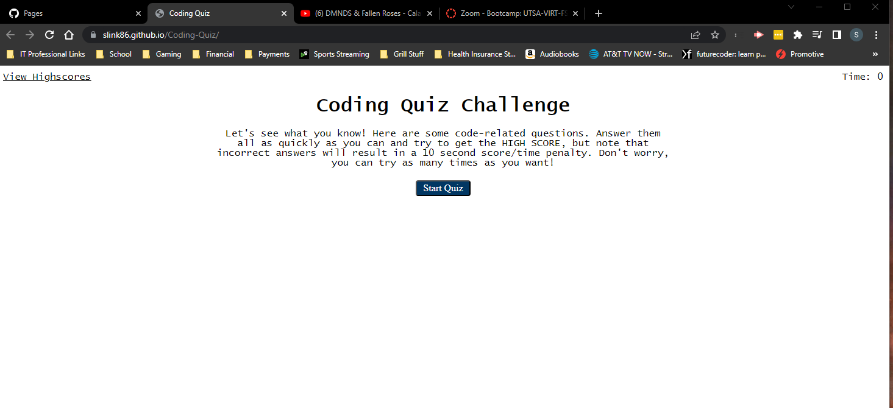

# Coding-Quiz

## Description

Create a Web App Coding Quiz with Highscore page.

- Technical
    <ul>
     <li>Create index.html and score.html</li>
     <li>Create script.js that calls on questions.js to perform a quiz</li>
     <li>Deploy site on gitpages</li>
     <li>Add and notate README</li>
     </ul>
- Deployment
    <ul>
     <li>Deploy Live URL</li>
     <li>Load with no errors</li>
     <li>Submit Github URL</li>
     <li>Repo Contains app code</li>
    </ul>
- Repo Quality
    <ul>
     <li>Unique Name</li>
     <li>Best Practices</li>
     <li>Descriptive Commit messages</li>
     <li>Contains README file</li>
    </ul>

## Screenshot

## Depoloyed App Link

Link to Deployed Site: https://slink86.github.io/Coding-Quiz/